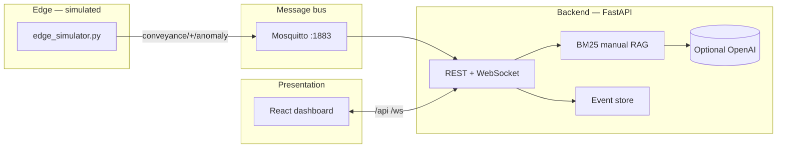

<div align="center">

# Factory Genius

### Advanced ML & AI engineering for conveyance and rotating equipment

**Industry reference stack:** simulated **edge anomaly payloads** → **MQTT** → **BM25 RAG** + optional **LLM reasoning** → **technician dashboard** (preventive vs. breakdown guidance with cited manual excerpts).

[](https://www.python.org/)
[](https://fastapi.tiangolo.com/)
[](https://react.dev/)
[](https://mosquitto.org/)
[](https://www.docker.com/)

<br />


<br />

| Domain | Stack highlights |
|:------:|------------------|
| **Industrial AI** | Lexical RAG over maintenance knowledge; optional **OpenAI-compatible** LLM for narrative diagnosis |
| **Event-driven ops** | MQTT topic pattern `conveyance/+/anomaly`; REST + **WebSocket** for live UI |
| **Human-in-the-loop** | Dashboard for **condition-based** vs **immediate** response hints — not autonomous control |

<br />

*Product & architecture:* [`docs/product/plan.md`](docs/product/plan.md) · [`docs/architecture/overview.md`](docs/architecture/overview.md)

</div>

---

> **Safety notice:** This is **not** production safety software. Validate every maintenance action with your plant procedures, OEM manuals, and qualified personnel.

---

## Table of contents

- [Why this exists](#why-this-exists)
- [Architecture](#architecture)
- [MLOps & production path](#mlops--production-path)
- [Quick start](#quick-start)
- [Configuration](#configuration)
- [Extending the knowledge base](#extending-the-knowledge-base)
- [API sketch](#api-sketch)
- [Roadmap](#roadmap)
- [License](#license)

---

## Why this exists

**Factory Genius** targets **conveyance systems** — lines, drive stations, and **rotary equipment** (shafts, pulleys, idlers, rollers). Teams need to see whether a signal fits a **preventive / condition-based** window or suggests **breakdown / immediate** response, with **traceability** back to manual text.

This repository ships a **fully runnable prototype**: simulated edge payloads, MQTT on `conveyance/+/anomaly`, **BM25** retrieval over sample maintenance Markdown, optional **LLM** synthesis, and a React operator console. It is designed as an **AI engineering** baseline you can extend toward embedding stores, multimodal models (spectrograms, thermal imaging), and EAM integrations.

---

## Architecture



| Layer | Implementation |
|--------|----------------|
| Edge node | `scripts/edge_simulator.py` publishes JSON anomalies to `conveyance/{asset_id}/anomaly` |
| Transport | Eclipse Mosquitto (`docker compose up -d`) |
| RAG | `backend/app/rag_engine.py` — BM25 over `data/knowledge/*.md` |
| Reasoning | Template synthesis from retrieval; **or** OpenAI Chat Completions when `OPENAI_API_KEY` is set |
| UI | `web/` — Vite, React 18, Tailwind 3 |

---

## MLOps & production path

| Concern | In this repo | Typical next steps (industry) |
|---------|--------------|------------------------------|
| **Retrieval** | BM25 on local Markdown chunks | **Embedding + vector DB** (Qdrant, Milvus, pgvector); hybrid sparse + dense retrieval |
| **Knowledge lifecycle** | Edit files under `data/knowledge/`; restart API | Versioned knowledge bundles; CI checks for broken links; staged rollout per site |
| **LLM gateway** | Optional OpenAI-compatible client | Private endpoint, rate limits, **PII redaction**, prompt/version registry, fallback to template-only mode |
| **Evaluation** | Manual dashboard review | Retrieval hit-rate, nDCG, technician feedback loops; golden sets per asset class |
| **Serving & infra** | `uvicorn` + static `web/dist`; Docker Compose for MQTT | Container images per service; health checks; secrets via vault / env injection (**never commit API keys**) |
| **Observability** | Event API + WebSocket stream | Structured logs with **correlation IDs**; metrics on ingest rate, RAG latency, LLM errors (generic client messages) |

The **roadmap** below aligns with turning this prototype into a governed **MLOps** pipeline (on-device DSP, vector search at scale, multimodal VLM, EAM connectors).

---

## Quick start

### 1. Python environment

```bash
cd Factory-genius
python3 -m venv .venv
source .venv/bin/activate   # Windows: .venv\Scripts\activate
pip install -r requirements.txt
```

### 2. Message broker (optional but recommended)

```bash
docker compose up -d
```

If Mosquitto is not running, the API still starts; the MQTT worker logs a connection error and you can use **HTTP demo ingest** instead.

### 3. Build the dashboard (served by the API on port 8000)

```bash
cd web && npm install && npm run build && cd ..
```

### 4. Run the API

```bash
source .venv/bin/activate
uvicorn backend.app.main:app --reload --host 0.0.0.0 --port 8000
```

- **Dashboard:** [http://127.0.0.1:8000](http://127.0.0.1:8000) (static `web/dist` if built)
- **Health:** [http://127.0.0.1:8000/api/health](http://127.0.0.1:8000/api/health)

### 5. Inject an anomaly

**Option A — MQTT (with broker running)**

```bash
source .venv/bin/activate
python scripts/edge_simulator.py --scenario drive_shaft
python scripts/edge_simulator.py --machine-id merge-table-rotary-2 --scenario merge_rotary
```

**Option B — HTTP (no broker)**

Use the buttons in the UI, or:

```bash
curl -s -X POST http://127.0.0.1:8000/api/demo/ingest \
  -H "Content-Type: application/json" \
  -d '{"machine_id":"conveyance-main-drive-1","thermal_c":86,"thermal_baseline_c":48,"acoustic_anomaly":true,"acoustic_band_hz":"2000-4000","rgb_summary":"Heat at pillow block","trigger_reason":"drive_shaft_thermal_and_bearing_acoustic"}'
```

### 6. Developer UI (hot reload, separate port)

```bash
# terminal 1: API on 8000
uvicorn backend.app.main:app --reload --port 8000

# terminal 2: Vite dev server proxies /api and /ws
cd web && npm run dev
```

Open [http://127.0.0.1:5173](http://127.0.0.1:5173).

---

## Configuration

| Variable | Default | Purpose |
|----------|---------|---------|
| `MQTT_HOST` | `127.0.0.1` | Broker host |
| `MQTT_PORT` | `1883` | Broker port |
| `KNOWLEDGE_DIR` | `data/knowledge` | Markdown manuals for RAG |
| `OPENAI_API_KEY` | unset | Enables LLM narrative diagnosis |
| `OPENAI_BASE_URL` | `https://api.openai.com/v1` | Compatible API base |
| `OPENAI_MODEL` | `gpt-4o-mini` | Chat model name |
| `CORS_ORIGINS` | `http://localhost:5173,...` | Allowed browser origins |

Create a `.env` file in the repo root (optional). **Do not commit secrets.**

---

## Extending the knowledge base

Add or edit Markdown under `data/knowledge/`. Chunks are derived per file (split on markdown headings). Restart `uvicorn` to reload.

---

## API sketch

| Method | Path | Description |
|--------|------|-------------|
| `GET` | `/api/health` | Liveness + RAG chunk count |
| `GET` | `/api/events` | Recent diagnostic events |
| `POST` | `/api/demo/ingest` | Dev-only anomaly injection |
| `WS` | `/ws/events` | Push + initial backlog for the dashboard |

---

## Roadmap

Aligned with [`docs/product/plan.md`](docs/product/plan.md) and [`docs/architecture/overview.md`](docs/architecture/overview.md):

- On-device DSP, acoustic privacy band-pass, and real Jetson-class firmware  
- Embedding + Milvus/Qdrant (or managed vector search) at scale  
- Multimodal VLM on spectrograms and imagery  
- EAM connectors (SAP PM, Maximo) and feedback loops from technicians  

---

## License

Specify your organization’s license here if applicable.

---

<div align="center">

**Advanced ML & generative AI patterns for industrial maintenance — observable, extensible, and ready for real MLOps hardening.**

</div>
