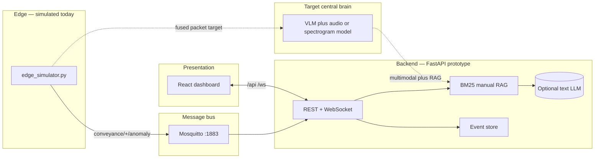

<div align="center">

# Factory Genius

### Generative-AI maintenance copilot for auto-plant critical assets

**GitHub:** [`vgandhi1/factory-genius`](https://github.com/vgandhi1/factory-genius) · **Local path (workspace):** `factory-system-AI/factory-genius/`

**Industry reference stack:** simulated **multimodal edge payloads** (thermal + optical summary + acoustic cues; optional **artifact refs** for thermal/RGB/spectrogram) → **MQTT** → **BM25 RAG** + optional **LLM text reasoning** → **technician dashboard** (preventive vs. breakdown guidance with cited manual excerpts). **Target brain:** centralized **VLM + audio/spectrogram** models on fused evidence + RAG (see [`docs/architecture/overview.md`](docs/architecture/overview.md)).

[](https://www.python.org/)
[](https://fastapi.tiangolo.com/)
[](https://react.dev/)
[](https://mosquitto.org/)
[](https://www.docker.com/)

<br />


<br />

| Domain | Stack highlights |
|:------:|------------------|
| **Industrial AI** | Lexical RAG over maintenance knowledge; optional **OpenAI-compatible** LLM for text diagnosis; **roadmap:** VLM + spectrogram/audio model on fused packets |
| **Event-driven ops** | MQTT topic pattern `conveyance/+/anomaly`; REST + **WebSocket** for live UI |
| **Human-in-the-loop** | Dashboard for **condition-based** vs **immediate** response hints — not autonomous control |

<br />

*Product & architecture:* [`plan.md`](plan.md) · [`docs/architecture/overview.md`](docs/architecture/overview.md) · [`docs/COMPREHENSIVE-REPORT.md`](docs/COMPREHENSIVE-REPORT.md)

</div>

---

> **Safety notice:** This is **not** production safety software. Validate every maintenance action with your plant procedures, OEM manuals, and qualified personnel.

> **Naming (not a duplicate repo):** Product name **Factory Genius** · GitHub repo **[`factory-genius`](https://github.com/vgandhi1/factory-genius)** · this directory *is* that repo. It lives under `factory-system-AI/` for workspace grouping only, separate from the Digital Twin / FactoryOps / VisionGuard portfolio. Push local commits to sync GitHub if the remote README looks stale.

---

## Table of contents

- [Why this exists](#why-this-exists)
- [Architecture](#architecture)
- [MLOps & production path](#mlops--production-path)
- [Quick start](#quick-start)
- [Configuration](#configuration)
  - [Environment variables with uv](#environment-variables-with-uv)
- [Extending the knowledge base](#extending-the-knowledge-base)
- [API sketch](#api-sketch)
- [Roadmap](#roadmap)
- [License](#license)

---

## Why this exists

**Stamping presses, conveyor systems, and CNC machines** are the heartbeat of an auto plant; an unexpected stoppage can cost **tens of thousands of dollars per minute**. Classic sensors (vibration, heat) **raise alarms** but rarely tell a technician **how to fix** the machine. **Factory Genius** is a **generative-AI maintenance copilot** concept: a **Jetson-class edge** fuses **thermal (FLIR-class), optical, and directional-mic / spectrogram** evidence; on anomaly it sends a **fused packet** to a **central brain** (**VLM + audio model**, industry-tuned) augmented by **RAG** over manuals so responses are **actionable and cited**.

This repository ships a **fully runnable prototype** of the **guidance loop**: simulated edge payloads, MQTT on `conveyance/+/anomaly`, **BM25** retrieval over sample maintenance Markdown, optional **text** LLM synthesis, and a React operator console. It is an **AI engineering** baseline toward real multimodal inference, embedding stores, and EAM integrations—not a substitute for production edge DSP or certified safety procedures.

---

## Architecture



| Layer | Implementation |
|--------|----------------|
| Edge node | `scripts/edge_simulator.py` publishes JSON anomalies to `conveyance/{asset_id}/anomaly` |
| Transport | Eclipse Mosquitto (`docker compose up -d`) |
| RAG | `backend/app/rag_engine.py` — BM25 over `data/knowledge/*.md` |
| Reasoning | Template synthesis from retrieval; **or** OpenAI **text** Chat Completions when `OPENAI_API_KEY` is set; **target:** VLM + audio on fused imagery or spectrogram refs |
| UI | `web/` — Vite, React 18, Tailwind 3 |

---

## MLOps & production path

| Concern | In this repo | Typical next steps (industry) |
|---------|--------------|------------------------------|
| **Retrieval** | BM25 on local Markdown chunks | **Embedding + vector DB** (Qdrant, Milvus, pgvector); hybrid sparse + dense retrieval |
| **Knowledge lifecycle** | Edit files under `data/knowledge/`; restart API | Versioned knowledge bundles; CI checks for broken links; staged rollout per site |
| **LLM gateway** | Optional OpenAI-compatible client | Private endpoint, rate limits, **PII redaction**, prompt/version registry, fallback to template-only mode |
| **Evaluation** | Manual dashboard review | Retrieval hit-rate, nDCG, technician feedback loops; golden sets per asset class |
| **Serving & infra** | `uvicorn` + static `web/dist`; Docker Compose for MQTT | Container images per service; health checks; secrets via vault / env injection (**never commit API keys**) |
| **Observability** | Event API + WebSocket stream | Structured logs with **correlation IDs**; metrics on ingest rate, RAG latency, LLM errors (generic client messages) |

The **roadmap** below aligns with turning this prototype into a governed **MLOps** pipeline (Jetson on-device DSP and spectrograms, **VLM + audio** serving, vector search at scale, EAM connectors).

---

## Quick start

### 1. Python environment ([uv](https://docs.astral.sh/uv/) recommended)

Install [uv](https://docs.astral.sh/uv/getting-started/installation/) if needed, then from the repo root:

```bash
cd factory-genius
uv venv                    # creates .venv (Python 3.11+)
source .venv/bin/activate  # Windows: .venv\Scripts\activate
uv pip install -r requirements.txt
```

<details>
<summary>Alternative: <code>python -m venv</code> + <code>pip</code></summary>

```bash
cd factory-genius
python3 -m venv .venv
source .venv/bin/activate   # Windows: .venv\Scripts\activate
pip install -r requirements.txt
```

</details>

See [Configuration → Environment variables with uv](#environment-variables-with-uv) to create a `.env` file before starting the API (optional for local defaults; required for LLM keys).

### 2. Message broker (optional but recommended)

```bash
docker compose up -d
```

If Mosquitto is not running, the API still starts; the MQTT worker logs a connection error and you can use **HTTP demo ingest** instead.

### 3. Build the dashboard (served by the API on port 8000)

```bash
cd web && npm install && npm run build && cd ..
```

### 4. Run the API

With an activated venv (from step 1):

```bash
source .venv/bin/activate
uvicorn backend.app.main:app --reload --host 0.0.0.0 --port 8000
```

Or run through **uv** and load variables from `.env` in one step (no manual `source` required):

```bash
uv run --env-file .env uvicorn backend.app.main:app --reload --host 0.0.0.0 --port 8000
```

If you have not created `.env` yet, omit `--env-file .env`; defaults from the table below apply.

- **Dashboard:** [http://127.0.0.1:8000](http://127.0.0.1:8000) (static `web/dist` if built)
- **Health:** [http://127.0.0.1:8000/api/health](http://127.0.0.1:8000/api/health)

### 5. Inject an anomaly

**Option A — MQTT (with broker running)**

```bash
source .venv/bin/activate
python scripts/edge_simulator.py --scenario drive_shaft
python scripts/edge_simulator.py --machine-id merge-table-rotary-2 --scenario merge_rotary
python scripts/edge_simulator.py --machine-id cnc-hmc-7 --scenario cnc_spindle
```

Or with uv:

```bash
uv run --env-file .env python scripts/edge_simulator.py --scenario drive_shaft
```

**Option B — HTTP (no broker)**

Use the buttons in the UI, or:

```bash
curl -s -X POST http://127.0.0.1:8000/api/demo/ingest \
  -H "Content-Type: application/json" \
  -d '{"machine_id":"conveyance-main-drive-1","thermal_c":86,"thermal_baseline_c":48,"acoustic_anomaly":true,"acoustic_band_hz":"2000-4000","rgb_summary":"Heat at pillow block","trigger_reason":"drive_shaft_thermal_and_bearing_acoustic"}'
```

**Option C — machinery audio (WAV/FLAC)**

```bash
curl -s -X POST http://127.0.0.1:8000/api/audio/diagnose \
  -F "machine_id=conveyance-main-drive-1" \
  -F "asset_class=conveyor" \
  -F "audio=@/path/to/recording.wav"
```

### 6. Developer UI (hot reload, separate port)

```bash
# terminal 1: API on 8000
uvicorn backend.app.main:app --reload --port 8000

# terminal 2: Vite dev server proxies /api and /ws
cd web && npm run dev
```

Open [http://127.0.0.1:5173](http://127.0.0.1:5173).

---

## Configuration

Settings are defined in `backend/app/config.py` ([Pydantic Settings](https://docs.pydantic.dev/latest/concepts/pydantic_settings/)). Field names map to **uppercase environment variables** (e.g. `mqtt_host` → `MQTT_HOST`). The API also reads a **`.env` file in the repo root** when present (see `.gitignore` — **never commit** `.env`).

### Environment variables with uv

**1. Create `.env` in the repo root**

From `factory-genius/`, copy the template and edit values (especially `OPENAI_API_KEY` if you want LLM diagnosis):

```bash
cat > .env << 'EOF'
# MQTT (optional — defaults work with docker compose Mosquitto)
MQTT_HOST=127.0.0.1
MQTT_PORT=1883
MQTT_TOPIC_PATTERN=conveyance/+/anomaly

# RAG knowledge base (path relative to repo root or absolute)
KNOWLEDGE_DIR=data/knowledge

# Optional OpenAI-compatible LLM (leave OPENAI_API_KEY empty for template-only diagnosis)
OPENAI_API_KEY=
OPENAI_BASE_URL=https://api.openai.com/v1
OPENAI_MODEL=gpt-4o-mini

# Dashboard dev server + API CORS (comma-separated)
CORS_ORIGINS=http://localhost:5173,http://127.0.0.1:5173

# Max upload size for /api/audio/* (bytes; default 25 MiB)
MAX_AUDIO_UPLOAD_BYTES=26214400
EOF
```

Set secrets without putting them in shell history (example):

```bash
# append or replace one variable
echo 'OPENAI_API_KEY=sk-your-key-here' >> .env
```

**2. Install dependencies into the uv-managed venv**

```bash
uv venv
uv pip install -r requirements.txt
```

**3. Run commands with `.env` loaded**

`uv run --env-file .env` injects variables for that process. The FastAPI app **also** loads `.env` via Pydantic when the working directory is the repo root, so either approach works:

```bash
# API
uv run --env-file .env uvicorn backend.app.main:app --reload --host 0.0.0.0 --port 8000

# Edge simulator
uv run --env-file .env python scripts/edge_simulator.py --scenario drive_shaft
```

**4. One-off overrides (no file edit)**

```bash
MQTT_HOST=127.0.0.1 MQTT_PORT=1883 uv run uvicorn backend.app.main:app --reload --port 8000
```

**5. Verify variables are picked up**

After starting the API, `GET /api/health` does not expose secrets. To confirm LLM mode, ingest a demo event and check whether the diagnosis title starts with `LLM diagnosis` (requires a valid `OPENAI_API_KEY`).

| Variable | Default | Purpose |
|----------|---------|---------|
| `MQTT_HOST` | `127.0.0.1` | Broker host |
| `MQTT_PORT` | `1883` | Broker port |
| `MQTT_TOPIC_PATTERN` | `conveyance/+/anomaly` | MQTT subscribe pattern for anomaly payloads |
| `KNOWLEDGE_DIR` | `data/knowledge` | Markdown manuals for RAG |
| `OPENAI_API_KEY` | unset | Enables LLM narrative diagnosis |
| `OPENAI_BASE_URL` | `https://api.openai.com/v1` | Compatible API base |
| `OPENAI_MODEL` | `gpt-4o-mini` | Chat model name |
| `CORS_ORIGINS` | `http://localhost:5173,...` | Allowed browser origins (comma-separated) |
| `MAX_AUDIO_UPLOAD_BYTES` | `26214400` | Max bytes for `/api/audio/*` uploads (25 MiB) |

**Do not commit** `.env`, API keys, or presigned URLs with credentials. Use your org’s secret store in production.

---

## Extending the knowledge base

Add or edit Markdown under `data/knowledge/`. Chunks are derived per file (split on markdown headings). Restart `uvicorn` to reload.

---

## API sketch

| Method | Path | Description |
|--------|------|-------------|
| `GET` | `/api/health` | Liveness + RAG chunk count |
| `GET` | `/api/events` | Recent diagnostic events |
| `POST` | `/api/demo/ingest` | Dev-only anomaly injection (JSON) |
| `POST` | `/api/audio/analyze` | STFT band-energy summary from uploaded WAV/FLAC (JSON body) |
| `POST` | `/api/audio/diagnose` | Same analysis, then BM25 + optional LLM; `multipart/form-data` with `machine_id`, `audio` file, optional `asset_class`, `thermal_c`, … |
| `WS` | `/ws/events` | Push + initial backlog for the dashboard |

---

## Roadmap

Aligned with [`plan.md`](plan.md) and [`docs/architecture/overview.md`](docs/architecture/overview.md):

- On-device fusion on **Jetson**: FLIR-class thermal plus RGB plus **directional-mic spectrograms**; privacy band-pass and real firmware  
- **Central brain:** industrially tuned **VLM + audio or spectrogram** model on fused packets; orchestration with RAG  
- Embedding plus Milvus or Qdrant (or managed vector search) at scale  
- Coverage expansion: **stamping presses**, **CNC**, conveyors, and shared plant services  
- EAM connectors (SAP PM, Maximo) and feedback loops from technicians  

---

## License

MIT — see [LICENSE](LICENSE).

---

<div align="center">

**Advanced ML & generative AI patterns for industrial maintenance — observable, extensible, and ready for real MLOps hardening.**

</div>
